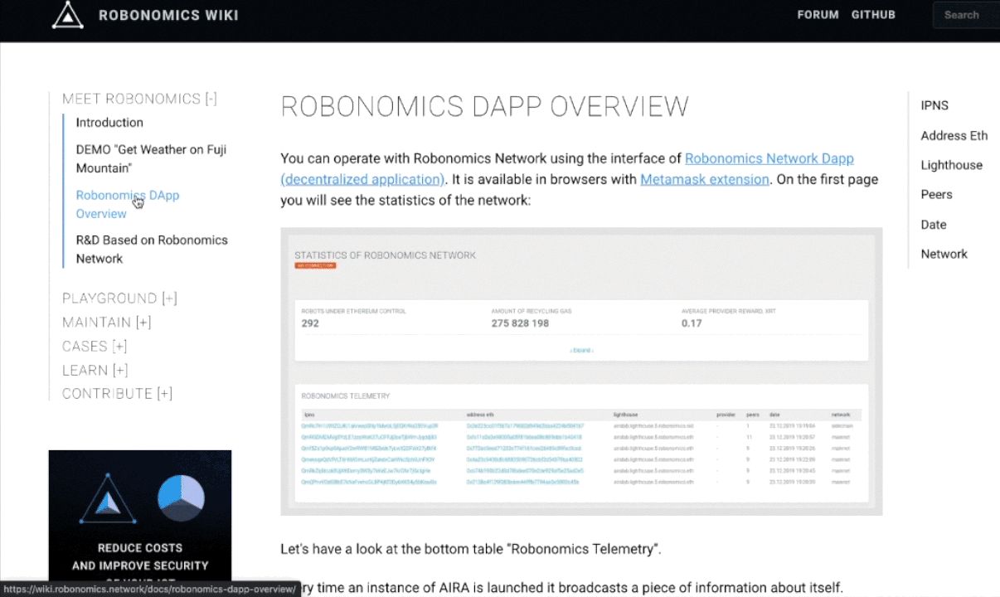

## Getting familiar with the basic functionality

The best way for a developer to understand the concept of Robonomics Network is to visit the [playground](https://wiki.robonomics.network/docs/create-account-in-dapp/) section and try it.

The [playground](https://wiki.robonomics.network/docs/create-account-in-dapp/) section guides people through the process of launching cyber-physical-systems under Robonomics control. A participant can choose any of the offered paragraphs for acquaintance with the Robonomics Network.

1st wave of participants will be rewarded with **200$ (In the form of native Robonomics token - XRT) for completing the following task**:

* Read step by step instruction in [playground](https://wiki.robonomics.network/docs/create-account-in-dapp/) section of the wiki;
* Launch any type of IoT devices or Robotics system in simulation or real;
* Upload the video on YouTube, in a video participant has to explain:
    * How does the launch process work with comments + screencast;
    * How can one store a CPS’es datalog in Blockchain with the help of IPFS;
* Make a Tweet and Mention @Aira_robonomics Twitter account and Tag $XRT and #robonomicsnetwork.

In the Tweet, a participant should share his experience of launching a robot on Robonomics Network.

## Store the global air pollution level in Robonomics Network

Robonomics Network aims to unveil a pollution level by citizens observation networks over the World and help people to offset the carbon footprint. Thus, core DAO developers came up with the [water](https://www.frontiersin.org/articles/10.3389/frobt.2020.00070/full) & air pollution sensors network, smart buildings offsetting and green certificates.

To drive the adoption of open-source sensors network based on Robonomics Web Services, the team decided to reward a first 15 participants with **$300 (In the form of native Robonomics token - XRT) for completing the following task:**

* Read step by [step instruction](https://wiki.robonomics.network/docs/connect-sensor-to-robonomics/) in “Cases” section of the wiki;
* Connect air pollution sensor to Robonomics & maintain it for more than 1 week;
* Upload the video on YouTube, in a video participant has to explain:
   * How does the process of connecting air pollution sensor to Robonomics Network look like + screencast;
   * How can one store an air pollution level in Blockchain with the help of IPFS;
* Make a Tweet and Mention @Aira_robonomics Twitter account and Tag $XRT and #robonomicsnetwork.

In the Tweet, a participant should share geolocation of his sensor and share his experience connecting it to Robonomics Network.

## Making a research/Proof-of-Concept project on Robonomics Network

Robonomics Web Services is an excellent environment for creating your simulations of smart factories, robotics systems and digital twins of IoT devices.
**If you’re looking for a source of inspiration, we suggest you visit the Robonomics scientific resources:**

> [Research & Development](https://wiki.robonomics.network/docs/r-and-d-based-on-robonomics-network/) made on Robonomics Network;

> [Scientific researchers](https://robonomics.network/community#science) made by core Robonomics Network team members;

If you have any questions regarding the mentioned cases, please visit the Robonomics developers forum.

**Core Robonomics DAO IoT & Robotics developers will evaluate your project and help you in your research.** 
**Amount of the payout (up to 300 XRT per project) will be decided by DAO, depending on the difficulty of a project and your autonomy.**

## Participating in the Robonomics Web Services beta test

Robonomics Web Services(RWS) will bring a new era of IoT & Robotics infrastructure. 
It’ll provide developers with similar to Amazon Web Services functionality, but despite the centralized cloud base, it’s going to provide customers with access to the blockchain.

You can find out more about the [benefits of RWS here](https://blog.aira.life/robonomics-web-services-and-rws-token-intro-d730ab50ad42?source=collection_home---4------2-----------------------).

## RWS Beta test

We’re excited about providing industry 4.0 developers with the DLT infrastructure for their IoT & Robotics use cases.

Everyone, who’ll send telemetry from their IoT device to RWS will be entitled to a reward.
1000 XRT will be distributed between TOP-100 active participants based on the amount of transferred telemetry to RWS at the end of each month.

Fill in the form to participate in [Robonomics Web Services beta test](https://share.hsforms.com/1rlIfFL6ZSriaOjtf4NAGPw535vx).

Thank you for contributing to the development of autonomous robots economy.
