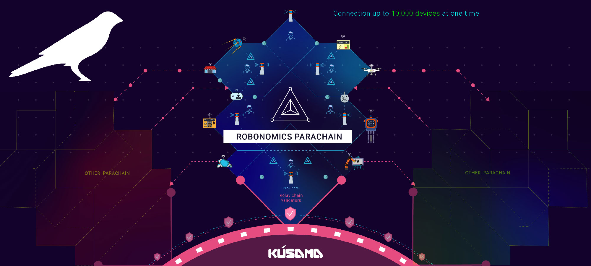
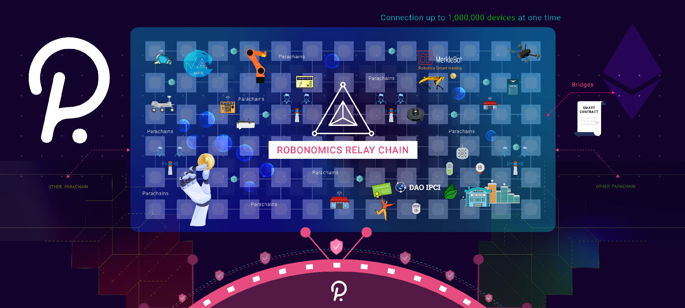

Robonomics developers aim to allocate $720,000 for a 2-year lease of a slot in the Kusama network. This underlying amount of XRT will be distributed among the KSM holders who will support the project with their tokens at the upcoming auction of Polkadot’s wild cousin.

We are delighted to announce that this offer will be 1.5 times more profitable compared to KSM staking. Moreover, during the period of the next 2 years, we will be preparing for the Polkadot slot auction that is expected to be set within the $ 3.2-6.4 million price range.

Below you will find the calculations and explanation of our chosen strategy with regards to the Kusama auction in 2020 and the Polkadot auction in 2022.

## Robonomics Parachain on Kusama first

As the Polkadot ecosystem makes its first steps, we understand that our goals must take into account not only the network’s final architecture, but also all important milestones in the future development of the network. We, the Robonomics developers team, believe that Kusama will serve as the primary pillar of Polkadot development in the upcoming 2 years, and hence, it is the Kusama network that we would like to concentrate all our efforts on.

> “Kusama first” is our development strategy in the Polkadot ecosystem for the next 2 years.

According to preliminary estimates, one slot of the Kusama network is enough to service up to 10,000 [digital twins](https://en.wikipedia.org/wiki/Digital_twin) of IoT devices at once with a subscription price of less than $10 per month. This will allow Robonomics to debug the process of connecting IoT systems during the lease of the Kusama slot. Next, we will be ready to scale the network to 1 million IoT systems connected in real-time by transforming the Robonomics network from Kusama Parachain to Polkadot Relay Chain.

## Robonomics Relay Chain on Polkadot is the vision

By the time the Polkadot network is technically ready to accept 100 parachain projects, and the Kusama network is successfully connected as a parachain in the Polkadot slot, Robonomics will be ready to introduce its own parachain of parachains to multiply the bandwidth. Based on our estimates, the Robonomics Relay Chain will allow the Polkadot network to serve up to 1 million IoT systems simultaneously with a subscription price of $2.

## Initial Parachain Offering and Robonomics Parachain Lease Offering
We recommend reading the following articles before continuing: [Obtaining a Parachain Slot on Polkadot](https://polkadot.network/obtaining-a-parachain-slot-on-polkadot/) and [Polkadot Parachain Slots](https://polkadot.network/polkadot-parachain-slots/).

Our goal in this article is to outline a fair price for the Robonomics Parachain Lease Offering in 2020 based on the following factors:
* Existing parameters of the launched Kusama and Polkadot networks;
* The forecast of Parity developers and the Web3 Foundation team;
* Community expectations versus current DOT and KSM staking rates.

The capitalization of the Kusama and Polkadot networks is estimated at $300 million and $4 billion respectively. At the moment, both networks have identical parameters: 10% inflation, 50% as target stake in the Relay chain and 100 parachains as the target number of projects in shared security. Given this data, we can estimate the 2-year slot lease in the Kusama network at $480,000, and $3,200,000 in the Polkadot network.

> You can find our in-depth calculations here: [Robonomics Parachain strategy](https://docs.google.com/spreadsheets/d/1LkKYNzwNABv6SQfCkZwRi99XW47xg6eR1-tdtp5CQIQ/).

Now, let’s try to sequentially perform a follow-up calculation in the table below:

### Step 1: Calculating the size of the KSM and DOT market available for auctions

Let’s consider that the number of KSM and DOT within an ideal stake will always be blocked by the community. Then, we subtract it from the most realistic amount of cryptocurrency in constant circulation and presume that the trading volume equals to 10% of the total token circulation.

| Total KSM: 10,000,000  | Total DOT: 1,000,000,000 |
| - | - |
| - 50% ideal stake ( -5,000,000 KSM)  | - 50% ideal stake ( -500,000,000 DOT)  |
| - 10% trade balance ( -1,000,000 KSM)  | - 10% trade balance ( -100,000,000 DOT)  |
| ** 4,000,000 KSM ** | ** 400,000,000 DOT ** |

4,000,000 KSM and 400,000,000 DOT - the size of the available cryptocurrency for bonding to parachains.

> Please note, that due to inflation, the total number of tokens will experience a year on year increase, but to simplify calculations, we do not take into account the increase in total supply. Moreover, we believe that the growth rate itself will not be significant enough in the first couple of years.

### Step 2: Estimating the expected return on the staking of KSM and DOT

The current inflation rate of 10% per year can be revised next year using the on-chain governance function, but we assume that this indicator will not be revised in the next 1.5-2 years. This means that the holders of KSM and DOT tokens can expect the return from the IPO of Polkadot projects to be at the level of 20% per annum. Resultantly, we can now calculate the expected return:

<table>
    <thead>
        <th colspan="2">Kusama shared security cost</th>
        <th colspan="2">Polkadot shared security cost</th>
    </thead>
    <tbody>
        <tr>
            <td>Total target bond, %</td>
            <td>40%</td>
            <td>Total target bond, %</td>
            <td>40%</td>
        </tr>
        <tr>
            <td>Target bond, KSM</td>
            <td>4,000,000.00</td>
            <td>Target bond, DOT</td>
            <td>400,000,000.00</td>
        </tr>
        <tr>
            <td>Lock period, years</td>
            <td>2</td>
            <td>Lock period, years</td>
            <td>2</td>
        </tr>
        <tr>
            <td>Expected return from 2 years bonding, %</td>
            <td>40%</td>
            <td>Expected return from 2 years bonding, %</td>
            <td>40%</td>
        </tr>
         <tr>
            <td>Expected return from 2 years bonding, $</td>
            <td>$48,000,000.00</td>
            <td>Expected return from 2 years bonding, %</td>
            <td>$640,000,000.00</td>
        </tr>
    </tbody>
</table>

As you can see, with the current capitalization of the Kusama and Polkadot networks, the parachains should in total, generate KSM and DOT token holders, a return of about $50,000,000 and $650,000,000 respectively every 2 years.

> ** Compound or simple interest in the calculation? **

> We do not believe that the formula of compound interest of staking reward accumulation is worth using and is applicable at this time. Robonomics and other parachains will offer DOT and KSM blocking schemes, where the reward will be accumulated either in full at the beginning of the slot lease, or in part during the entire lease period, whilst the funds themselves will be transferred to the address of the holder without restricting access to them. This means that making calculations based on simple interest is more realistic and more convenient.

### Step 3: Estimating the cost of shared security for one parachain slot
Polkadot developers are aiming to set 100 parachains with 1,000 validators within the Kusama and Polkadot Relay chains. Therefore, in our calculations, the Robonomics developers propose to take into account the target division of the shared security cost. This, in turn, means that the expected return from blocking KSM and DOT tokens is divided into 100 projects in our calculations.

In this case, we arrive to almost the same indicators of the network security annual costs, as mentioned in the article [Polkadot Parachain Slots](https://polkadot.network/polkadot-parachain-slots/) (~$200,000 per year). Of course, this relates only to the Kusama network, since the cost of Polkadot shared security is already high today ($3,200,000 per year). Nevertheless, given the transition of Robonomics to the Relay Chain state, we will be able to afford these security expenses and thereby provide the IoT market with the most secure globally accessible network in the world, the protection of which is already estimated at $4 billion.

<table>
    <thead>
        <th colspan="2">Kusama shared security cost</th>
        <th colspan="2">Polkadot shared security cost</th>
    </thead>
    <tbody>
        <tr>
            <td>Total target bond, %</td>
            <td>40%</td>
            <td>Total target bond, %</td>
            <td>40%</td>
        </tr>
        <tr>
            <td>Target bond, KSM</td>
            <td>4,000,000.00</td>
            <td>Target bond, DOT</td>
            <td>400,000,000.00</td>
        </tr>
        <tr>
            <td>Lock period, years</td>
            <td>2</td>
            <td>Lock period, years</td>
            <td>2</td>
        </tr>
        <tr>
            <td>Expected return from 2 years bonding, %</td>
            <td>40%</td>
            <td>Expected return from 2 years bonding, %</td>
            <td>40%</td>
        </tr>
        <tr>
            <td>Expected return from 2 years bonding, $</td>
            <td>$48,000,000.00</td>
            <td>Expected return from 2 years bonding, %</td>
            <td>$640,000,000.00</td>
        </tr>
        <tr>
            <td>Parachains, total</td>
            <td>100</td>
            <td>Parachains, total</td>
            <td>100</td>
        </tr>
        <tr>
            <td>Shared security cost annual per parachain</td>
            <td>$240,000.00</td>
            <td>Shared security cost annual per parachain</td>
            <td>$3,200,000.00</td>
        </tr>
        <tr>
            <td>Lease period, month</td>
            <td>24</td>
            <td>Lease period, month</td>
            <td>24</td>
        </tr>
        <tr>
            <td>Expected reward per parachain</td>
            <td>$480,000.00</td>
            <td>Expected reward per parachain</td>
            <td>$6,400,000.00</td>
        </tr>
    </tbody>
</table>

## On-Chain Governance Strategy

The beginning of the Robonomics’ parachain existence will be supported with funds allocated by the developers’ DAO. In the future, we plan that commissions from the monthly subscription activations for digital twins of IoT systems will be accumulated on the On-Chain Treasury account (minus the commission of the collators and the further development fund). Funds from the treasury will be governed by the parachain technical committee for participation in the subsequent auctions of Kusama and Polkadot slots. Potentially, funds in the form of a 2-year commission should be sufficient enough to extend the slot lease after Robonomics transitions to the Relay Chain state.

<table>
    <thead>
        <th colspan="2">Robonomics Parachain on Kusama</th>
        <th colspan="2">Robonomics Relay chain on Polkadot</th>
    </thead>
    <tbody>
        <tr>
            <td>tps</td>
            <td>1,500.00</td>
            <td>tps</td>
            <td>300,000.00</td>
        </tr>
        <tr>
            <td>block time</td>
            <td>6</td>
            <td>block time</td>
            <td>4</td>
        </tr>
        <tr>
            <td>IoT Monthly subscriptions, max</td>
            <td>9,000.00</td>
            <td>IoT Monthly subscriptions, max</td>
            <td>1,200,000.00</td>
        </tr>
        <tr>
            <td>Subscription price</td>
            <td>$10.00</td>
            <td>Subscription price</td>
            <td>$2.00</td>
        </tr>
        <tr>
            <td>2 years leasing slot total commissions</td>
            <td>$2,160,000.00</td>
            <td>2 years leasing slot total commissions</td>
            <td>$57,600,000.00</td>
        </tr>
        <tr>
            <td>Parachain collators incentive, %</td>
            <td>2%</td>
            <td>Parachain collators incentive, %</td>
            <td>2%</td>
        </tr>
        <tr>
            <td>Parachain collators incentive, total</td>
            <td>$43,200.00</td>
            <td>Parachain collators incentive, total</td>
            <td>$1,152,000.00</td>
        </tr>
        <tr>
            <td>Treasury</td>
            <td>$2,116,800.00</td>
            <td>Treasury</td>
            <td>$56,448,000.00</td>
        </tr>
        <tr>
            <td></td>
            <td></td>
            <td>Robonomics Relay chain validators incentive</td>
            <td>$15,000,000.00</td>
        </tr>
    </tbody>
</table>

Commission rates for collators will be determined by the democracy module, as well as inflation rates after the launch of the Robonomics Relay Chain.

## Ecosystem strategy

Robonomics is set to provide IoT devices with access to the Polkadot ecosystem, whilst Robonomics Parachains will store digital twins of these IoT devices. Within the parachain itself, users will be offered similar and even equivalent functions that are currently offered by other existing IoT cloud platforms such as AWS IoT, Azure IoT. In addition to standard IoT market functions implementations, for example, remote device launch and telemetry capture, Robonomics will be able to integrate with other projects in the eco-environment as they appear.

We believe that within 2 years, the list of available Polkadot ecosystem opportunities for the IoT market will be as follows:
* Storage and management of cyber-physical systems’ digital twins in the Robonomics parachain;
* Money for robots: integration of the most popular cryptocurrencies and tokens from the Polkadot ecosystem through XCMP;
* Smart contracts for robots: access to smart contracts using a bridge to Ethereum and support for EVM in parachains such as Plasm, Moonbeam, Edgeware;
* NFT identity for mobile robotics through projects such as Acala and Distributed Sky whitepaper;
* Tokenization of data from IoT devices for the environmental liability market based on DAO IPCI;
* A managed access to IoT systems using DAO for collective management of public, corporate and private spaces;
* Robotics Smart leasing and bond issue for the installation of robots in smart cities with distribution in the DeFi market.

## In conclusion

Robonomics is an infrastructure project for the Polkadot network, which aims to place more than 1 million digital twins of IoT devices with a level of security and global availability that the cloud platforms operated by IT corporations cannot provide. Robonomics developers will provide integration for these digital twins with ecosystem projects and thereby open access to previously inaccessible tools for automation systems of city living, logistics and production, namely, direct access to fintech solutions without banks.
