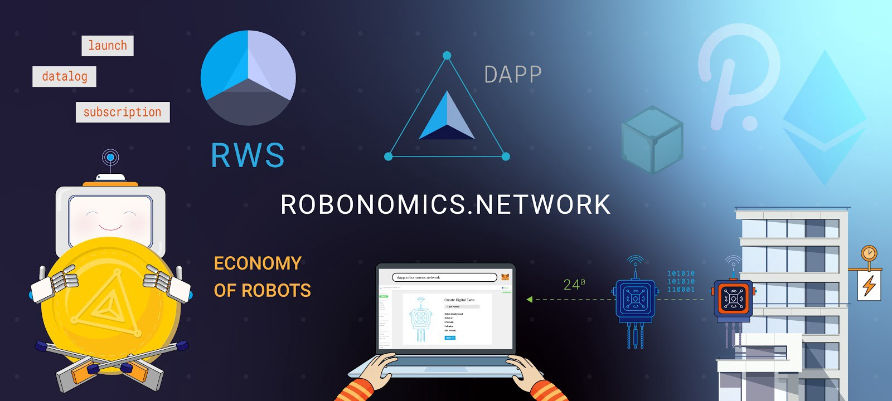
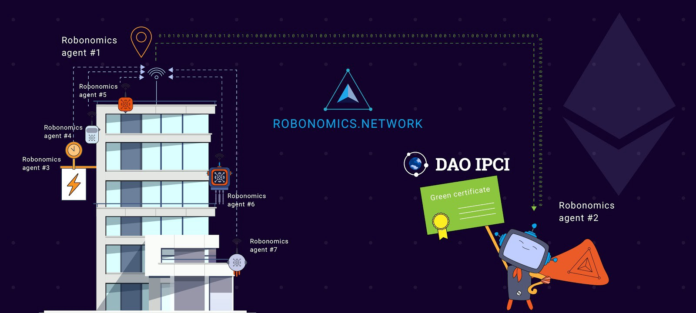
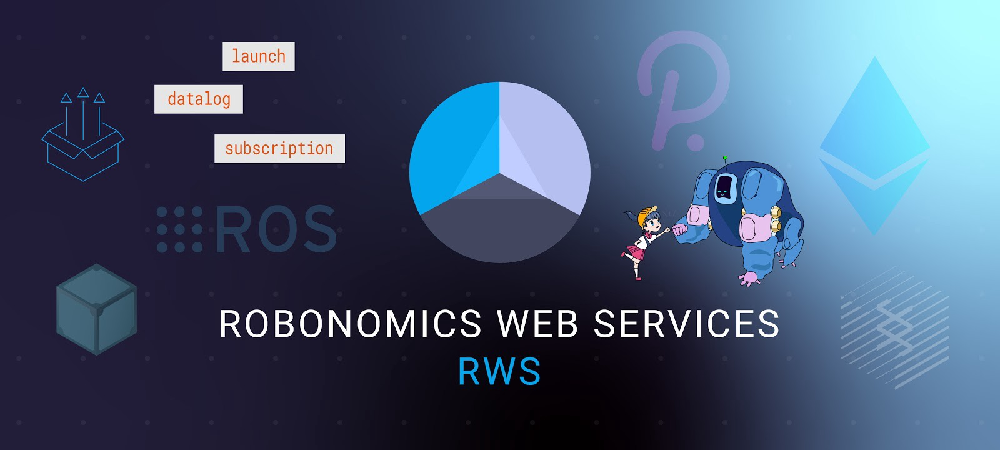
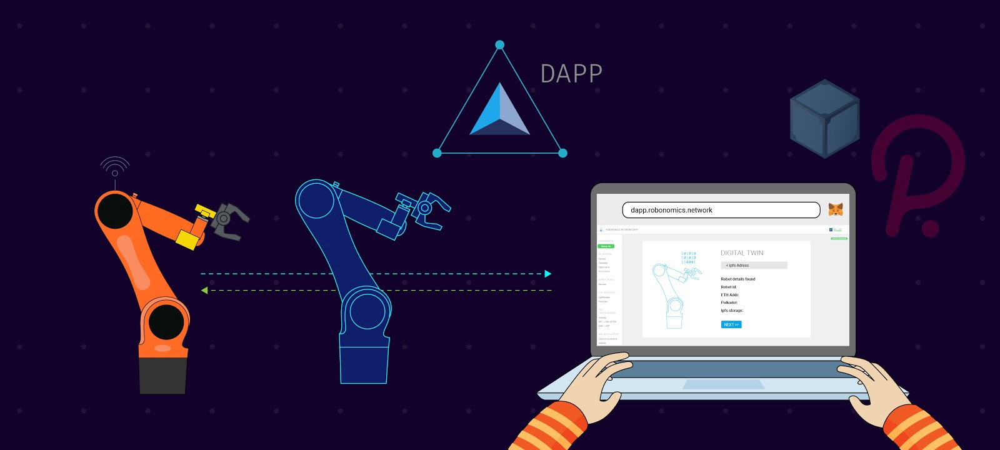

# The ultimate guide to Robonomics, RWS and Robonomics parachain on Polkadot

Taking into account the never-ending discussions on the backbone operation of Robonomics, let’s investigate the under the hood structure and outline the main pillars of the network. This article delves into the connection between [Robonomics platform](https://github.com/airalab), its [parachain](https://blog.aira.life/robonomics-parachain-on-kusama-40853780c709) on the Polkadot ecosystem and the [Robonomics Web Services](https://blog.aira.life/robonomics-web-services-and-rws-token-intro-d730ab50ad42) (RWS).

The Robonomics Network consists of multiple [repositories of code](https://github.com/airalab) that can be used separately in implementation of a fully-fledged IoT application. If you plan on connecting your smartphone for example to an IoT device, it is not enough to develop an app and link a bunch of sensors to it. Instead, you have to carry out a [chain of actions](https://blog.aira.life/simple-iot-scheme-990224363803) that will eventually lead to a connected IoT device and interconnected elements of the infrastructure, enabling the signal from the device to reach you.

## The chronology of the Robonomics Network development

So how did the idea to create the [Robonomics parachain](https://parachain.robonomics.network/#/explorer) and [Robonomics Network](https://robonomics.network/land/say-hello-to-robonomics/) came about? Originally, back in 2015–2017, we started with the development of a quite complicated solution we called the [Economy of Robots](https://blog.aira.life/the-first-in-the-economy-of-robots-6f4bb115643b). We are confident it is exactly what smart cities, industry 4.0 and the development of the IoT apps will come to.

Our primary goal was to create software for cyber-physical systems that can manage autonomous and independent devices within the technical and economic transactions framework. Therefore, we decided to generate a technical and economy biased transaction and make it serve as a foundation for the development of more complicated processes.

One of my favourite scenarios of the Economy of Robots is called [Smart Building Offsetting](https://new.dapp.ipci.io/#/offsetting). It is a service that allows an autonomous building to collect and aggregate information on its energy consumption and then communicate it to another agent within the Robonomics Network, and even request carbon footprint offset services. In turn, the agent verifies the location of the building, works out an applicable coefficient of CO2 emissions and then synchronizes this data with a partner project [DAO IPCI](http://ipci.io/), to determine the number of carbon credits from the green finance market that are required to offset the building’s carbon footprint. These operations were successfully executed on the Ethereum blockchain.

### The solution to the problem

Today, the Economy of Robots that we managed to build back in 2017 with our colleagues and partners, comprises a complicated at first glance chain, that acts as a final turn of the IoT industry evolution. The biggest issue we had was that we were amassing all the knowledge and realised our ideas, without having a chance to pass them on to anyone. Every new [scenario of the Economy of Robots](https://wiki.robonomics.network/docs/r-and-d-based-on-robonomics-network/), created during the development of Robonomics Network platform, was making the end product that little bit more complicated to understand for people foreign to the matter. In other words, one must be acquainted with multiple competencies and spend years to grasp the thinking behind intersecting disciplines that form the concepts of economy and machines working together.

When you start to understand the nuances behind the development of an IoT application, it quickly becomes apparent that technical specialists must spend years to reach a fully functioning product stage. This is why we decided to turn potential users of our platform into co-developers. We focused on teaching them to become professional IT engineers in the IoT application space and as a result, we created Robonomics parachain and Robonomics Web Services.

## Introduction to Robonomics Web Services

It is clear that the Economy of Robots is interesting to the public. Nevertheless, the main problem is that after a short while these users still flock to Amazon Web Services for IoT devices and start using that instead, without figuring out the critical advantages that the Robonomics Network carries compared to the renowned IT giants. This brought us to the conclusion that we cannot be about promises of completing something in the future without providing a real product here and now.

Therefore, we decided that a range of real services must be provided to our potential users. Services similar to what other cloud platforms are offering but better. As a result, we created Robonomics Web Services, a product built on our in-house protocols and platform that uses an open-source robotics framework (ROS). We then dedicated 2 years to the development of the key functions that I will now delve into in greater detail.

The key functions of RWS:
1) ***Subscription.***  
   
    The standard approach to blockchain services always includes transaction costs known as transaction fees or transaction gas. This means that when you make a transaction, its priority is dependent on the cost or fee that you are ready to pay for it. The higher the fee you pay, the faster your transaction will be processed. Such a model is not suitable for systems that rely on guaranteed bandwidth. You have to be absolutely sure that your device will be able to make a transaction at the set time and a predictable cost. This is something we don’t see often today, as transaction costs are fully dependent on the fluctuation of the exchange rates, at times reaching $50 in cost.

    To resolve this issue, we have created a Subscription service, which is an alternative cost model on the Robonomics parachain for Polkadot. It guarantees execution of a prepaid number of transactions and assigns them a higher priority compared to transactions that are paid through fee model. To learn more about the difference between monthly Subscription and XRT tokens you can revert to my ‘[Heterogeneous tokenomics](https://blog.aira.life/rws-overview-part-2-heterogeneous-tokenomics-afc209cc855)’ article, whilst my other piece planned to be released at the end of December will outline the final architecture and interconnection of the two models.

    Our Subscription model does not only solve the guaranteed transitioning problem but also only costs $10 per device, making it an extremely profitable offering for the end-user. Moreover, it provides a stable bandwidth for thousands of monthly transactions, which is quite a stellar achievement.

2) ***Launch.***

    Launch is a very simple but economical function from the usage of computing power and blockchain point of view. It allows you to turn on or off your device and change its binary setting from 1 to 0 and back by sending a request to it in the form of a transaction. Since there isn’t much complexity attached to this function, let’s move to the next critical pillar.

3) ***Datalog.***

    This function works with telemetry and therefore requires me to expand on it. It works in two modes where you either save your IPFS hashes or store data on the chain.

    So how do you use these modes? The on-chain datalog function is applicable when your data size is below four variables. There is simply no point in saving a chunk of data this small on IPFS (off chain), as bytes wise this on-chain log won’t be incrementally larger than the IPFS hash. We suggest recording the entire raw data inflow as a single function or opting for the IPFS hash. Then, Robonomics as a platform for developers will process the recorded data, be it raw or in form of an IPFS hash and decide where to write it to. This datalog processing will be hidden from the end-user and he/she won’t even notice the difference between two different types of storage.

    ‘Liability’ is our final function but it won’t be released to the public until we know the goals that large scale Economy of Robots projects pursue. Another milestone product for us that we are working on is aimed at [Robot as a Service](https://blog.aira.life/what-is-robonomics-network-robot-as-a-service-and-future-parachain-of-polkadot-or-something-more-36deece9f3cb) framework, or as we call it, the ‘contractually obliged robot’ on Ethereum. [This infrastructure](https://blog.aira.life/robots-under-robonomics-control-overview-39337ac9fbbb) has already been described in full detail in our knowledge hub and implies a situation where the end-user uses our service tokens without relying on XRT or other tokens to pay for parachain usage.

## What is the connection between RWS and the Economy of Robots?

As mentioned earlier, one of the goals behind Robonomics Web Services is to educate our users and turn them into co-developers who understand the Economy of Robots. We believe that there is nothing complicated about this task as long as the user gets acquainted with the basic functionality discussed above.

### Digital Twins

Next step in applying the instruments provided by Robonomics Web Services is to learn how to create a Digital Twin, otherwise known as a Digital Shadow for the app. It acts as a digital version of the real-world equipment and copies all of its technical characteristics.

What does this mean I hear you ask! Let’s take an intricate structure of sensors that measure the air quality as an example. You cannot make them do measurements every 5 seconds because their internal calibration and balancing of measured data takes 2 minutes. This is where a Digital Twin comes in, allowing us to make an app that is responsive to the user’s commands.

According to the [Gartner report on IoT market trends](https://www.gartner.com/en/innovation-strategy/trends/iot-adoption-trends), 85% of the companies that were part of the study have already implemented or plan to implement Digital Twins over the course of the next year. Most of these companies have in-house engineering teams that work on proprietary solutions. Nevertheless, they all acknowledge that they have to rely on already existing solutions to be able to scale quickly and keep their services adaptable to the constantly changing IoT industry environment.

This is why our parachain on the Robonomics Network doesn’t only offer the aforementioned functions that are not available on Ethereum IPFS, but also allows our users to create Digital Twins of their devices.

We are developing this feature to let users build their own Digital Twins, interpret them on web services/IoT apps and most importantly save them as a model that will write the datalog. Our [Wiki](http://wiki.robonomics.network/) is being constantly updated with all the required knowledge to execute the aforementioned solutions and will soon be complete with basic information that explains a Digital Twin build from A to Z.

### Applying Digital Twins

Once the data processing model is finalised and your Digital Twin is fully structured, you have to decide what will be its relation to the web service or an IoT application.

Analytics is often the common choice for such digital service, where a sensor sends you the data it measures (updates its digital copy). This data will most likely be subject to post-processing since it is highly unlikely that you are interested in the Pascals pressure value inside of your country house heating system. Instead, you need to know whether the temperature in the house is right and whether the heating system is still on. You basically have to decide how to apply the digital twin of the data that you saved on it and this is where additional services can help.

Now, we shift to a complex scenario of Smart Building Offsetting, where a copy of energy consumption data acts as a digital twin. Let’s say that you want to save energy consumption data for a given flat and use the Datalog function with IPFS storage for it. If you are looking to find out the total amount of consumed energy, you would save it on-chain. Opposingly, imagine that we run a digital twin of the smart building. The Offsetting Service will frequently ask this digital twin to provide various data on energy consumption, then store it and after performing off chain calculations, connect/talk to Robonomics in order to provide required services.

We gathered such services in a specialised [marketplace](https://dapp.robonomics.network/#/services) that acts as an App Store for robots.

## Understanding the Marketplace
In order to implement a model of interconnected digital twins and services, we must create a delivery medium for it or in other words an app on your smartphone. This marketplace, built on a decentralised ledger in face of decentralised applications, can be used to duplicate and create individual copies and digital twins for any required purpose out there via predefined templates. Most importantly, this is done without intermediaries and external storage, making our IoT services marketplace censor and centralized link free.

Last but not least, let’s talk about the user interface. We strive to always offer our users most up to date online technologies and therefore grant access to decentralized applications. The greatest feature you get during the development of your Dapp, is the lack of vulnerabilities on your side. Whilst your app is on IPFS, it is connected to the ENS registry or the Polkadot ecosystem registry and hence the user is not faced with the vulnerability of dealing with a substituted app or a request when following the hyperlink. It is simply very convenient from the point of view of end-user application development and its maintenance.

Another advantage of decentralised applications is peer-to-peer communication. In other words, your app can communicate to its digital twin, the IoT service and the end-user application without a single point of signal decline, eliminating the need for third parties and intermediary resources when a task needs to be executed. This is what the [robonomics.js](https://github.com/airalab/robonomics-js) is for, used in the development of [Dapp Robonomics](https://dapp.robonomics.network/#/). We are currently in the process of adding a new iteration of improvements and will soon release a Robonomics Stylebook (an interface guide based on web3.js and polkadot.js functions), leaving you with an easy job of structuring your application right. As a result, we complete the full Economy of Robots chain.

## Summary
* Our goal is to make [robots part of the economy](https://blog.aira.life/the-first-in-the-economy-of-robots-6f4bb115643b) but first, we need to teach the user on how everything works and set up.
* To aid the purpose, we have created the [Robonomics Web Services](https://blog.aira.life/robonomics-web-services-and-rws-token-intro-d730ab50ad42) product that allows users to build apps and services together with us (subscription, launch, datalog).
* Subscription to RWS resolves all transaction-related issues and adds functions that include: turning device on/off, telemetry (storage of a digital twin).
* Once you create a digital twin via in-house templates, you can develop an IoT service and add it to our [marketplace](https://dapp.robonomics.network/#/services). The pre-structured interfaces in Dapp are used as a delivery mechanism that take your service to the end-user.
* [Dapp](https://dapp.robonomics.network/) serves as a bulletproof way to establish a peer-to-peer (direct) communication with a digital twin, even when the service stops to operate. Regardless of the external circumstances, the market will never fail to work.
* The aforementioned chain is a pathway to the Economy of Robots described in this article.